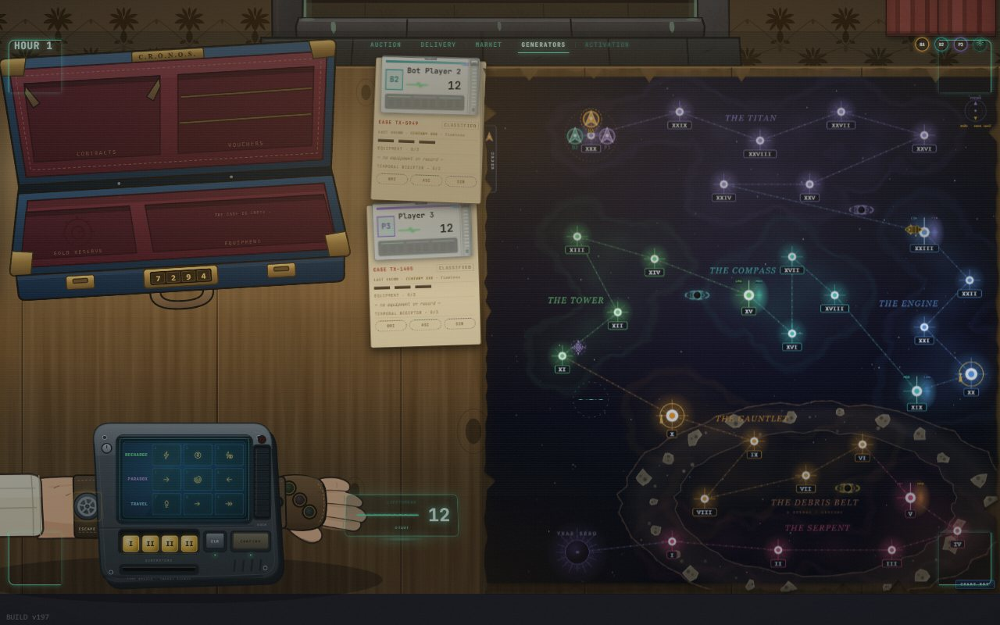
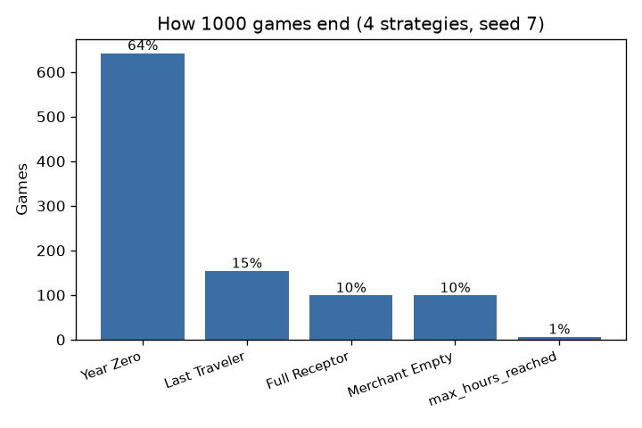
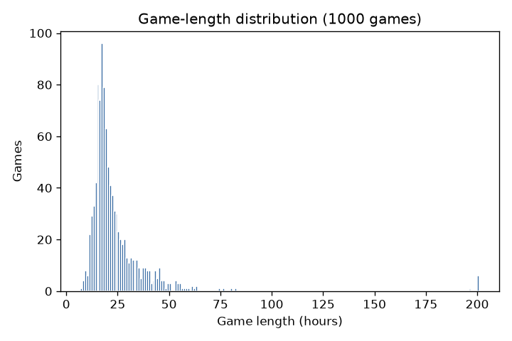

# Paradox: Timeline Incursion

**A competitive time travel board game, and the platform I built to balance it.**

[](https://github.com/reisaurafael/paradoxo-simulator/actions/workflows/tests.yml)


Paradox is an original board game I designed: two to six travelers race along a
timeline of thirty centuries, allocate four generators across a three by three time
machine every Hour, and throw paradoxes at each other while trying to reach Year Zero.
Fifty two cards, four ways to win.

This repository is not the game. It is the rules engine and the analysis platform I
wrote around it, so that balance questions get answered with thousands of games instead
of one afternoon at the table.

**[See the game: screenshots, rules and the interface](https://reisaurafael.github.io/paradoxo-simulator/)**

---

## The game is finished and playable

<p align="center"></p>

Paradox V1 is a complete digital board game: rules engine, web client, server, and bots
that sit at the same table as human players. It plays start to finish with no missing rules,
online between computers on the same network or across houses through a private network.

The client, the server and the game engine are not published here. I send access and
instructions to reviewers on request: <rafaelreissaura@gmail.com>.

The physical prototype is also up as a [Tabletopia table](https://tabletopia.com/games/paradoxocronos-dpnyrx/play-now).

## Why build a simulator for a board game

Board game balance is usually tested at the table, which is slow and gives very little
data. Around twenty people have played Paradox with me, and the feedback that mattered
most, that some strategies repeat themselves, is exactly the kind of thing a table test
takes months to confirm.

So I encoded the printed rules precisely enough for a computer to play the game correctly,
gave it four kinds of player, and ran it at scale. The Rules Reference is the only
authority in the engine: every mechanic is cited by section (§), and where the code and
the rulebook disagreed, the rulebook won.

Two audit passes found **15 divergences** between the engine and the printed rules. Each
one was reproduced as a failing test before it was fixed.

## What the engine covers

| Domain | Detail |
|---|---|
| **Cards** | All 52 cards implemented and individually tested |
| **Win conditions** | Year Zero, Full Receptor, Last Traveler Standing, Merchant-Empty |
| **Market** | Merchant deck (40 cards, Priority movement, century upgrades) and Secret Market (12 cards, gated by century, passives, vouchers) |
| **Paradox pipeline** | Distance-ordered damage with 6 stackable combat modifiers (Pólvora, Escudo, Armadura, Espada, Cálice, Caldeirão) |
| **Allocation matrix** | Linear progression (§10), overload (§11.1b) and escape valve (§11.2) enforced |
| **Termination** | Travelers eliminated and respawned at century XXX with banked energy; the last-survivor check fires before respawns |

## The four players

The four profiles are the instrument, not decoration. Aggressive invests in conflict,
Conservative protects resources, Collector buys and delivers, and Smart reads the board
before allocating. Putting them against each other is how I look at the economy: if one
line wins everywhere, the problem is the rule, not the player.

## Results

A reproducible benchmark of 1,000 games, four profiles, seed 7:

<p align="center">
  
  
</p>

| Metric | Value |
|---|---|
| **Win shares** | Aggressive 44%, Smart 24%, Conservative 16%, Collector 15% |
| **End conditions** | Year Zero 64%, Last Traveler 15%, Full Receptor 10%, Merchant-Empty 10% |
| **Average game length** | 23.5 Hours (median 19) |

The aggressive profile leads this lineup. These numbers describe the bots in a fixed
seating order, not balance between human players. Six games hit the 200 round limit with
no winner and are counted in the duration statistics. "Hours" are game rounds, not clock
hours.

The baseline was rerun on 11 September 2026 under Python 3.14.4: 441 Aggressive wins, 238
Smart, 164 Conservative, 151 Collector, 6 with no winner. The
[exported summary and every individual outcome](docs/benchmark-2026-09-11.json) are in the
repository.

### Scenario sweep

2,650 games across 9 configurations (`python -m examples.scenarios`):

| Scenario | Games | Avg length | Win shares |
|---|---|---|---|
| Standard, 4 diverse | 500 | 22.7h | Aggro 45%, Smart 22%, Cons 17%, Coll 16% |
| 4 Aggressive | 300 | 13.5h | Even spread 22-29%, short and violent |
| 4 Collectors | 300 | 66.0h | Even spread 17-23%, long resource races |
| 4 Smart | 300 | 21.3h | Even spread 22-27% |
| 2 player duel (Aggro vs Cons) | 300 | 19.9h | Aggressive 68%, Conservative 32% |
| 6 player | 200 | 18.8h | Both Aggressives lead (30%, 26%) |
| 3 player | 300 | 19.9h | Aggro 51%, Smart 27%, Cons 21% |
| 1 Aggressive vs 3 Conservative | 200 | 21.2h | Lone Aggressive 59% |
| Mixed (Aggro, Smart, 2 Collectors) | 250 | 34.3h | Aggro 34%, Collectors 23% and 18%, Smart 20% |

## What the numbers changed in the game

The simulations are not a report I file away. They moved cards, starting energy, the
explosion threshold and the energy price of reaching Year Zero. The table feedback about
repetitive strategies is what killed the fixed market: the merchant moves now, and the
board decides what is for sale.

## Running it

```bash
pip install -e ".[dev]"

pytest                                                   # 245 tests, about 0.2 s

python -m examples.run_benchmark 1000 7 benchmark.json   # summary and per-game JSON
python -m examples.make_plots                            # regenerate the charts
python -m examples.scenarios                             # 2,650 games, 9 configurations

python -m simulation.sim_menu                            # interactive runner, 8 chart types
python -m simulation.verbose_run                         # narrated play by play
python -m simulation.report out.html 42                  # single file HTML match report
```

A [sample match report](docs/sample_report.html) is committed for reference, and
[DEVLOG.md](docs/DEVLOG.md) records the decisions behind each round of work.

## Architecture

The engine resolves rules and the strategies decide. Strategy code never reaches into
engine internals, and the engine never knows which strategy is playing.

```
paradoxo/
├── engine/                  # Rules engine. The Rules Reference is the sole authority
│   ├── constants.py         # Every numeric constant, cited by §
│   ├── state.py             # TravelerState, GameState, Allocation dataclasses
│   ├── matrix.py            # Allocation validator, overload, escape valve (§10, §11)
│   ├── dice.py              # Generator rolls (§2)
│   ├── resolve.py           # Phase by phase resolution, Priority ordering (§12, §27)
│   ├── paradox.py           # Damage pool and distance ordering (§18, §16)
│   ├── timeline.py          # Board, eras, periods, Year Zero (§5)
│   ├── market.py            # Merchant movement and market phases (§17-19, §23-24)
│   ├── combat.py            # Unified energy loss pipeline, card modifier hooks
│   ├── cards.py             # All 52 cards: cost, recycle value, abilities (§6)
│   └── rewards.py           # Contract Point reward table (§23, §32)
│
├── simulation/              # Analysis platform. Imports the engine, nothing else
│   ├── strategies/          # The four profiles behind a single interface
│   ├── runner.py            # simulate_game(), simulate_n_games()
│   ├── metrics.py           # Win rate, length, energy and CP distributions
│   ├── sim_menu.py          # Interactive runner, 8 chart types, ASCII reports
│   ├── report.py            # Single file HTML match report
│   └── verbose_run.py       # Narrated play by play of one game
│
├── examples/                # Reproducible entry points
└── tests/                   # 245 tests, about 0.2 s
```

Python 3.11 or newer, dataclasses and `__slots__`, no runtime dependencies. About 500
games per minute, so a 1,000 game batch takes roughly two minutes.

## Where the project is

| | |
|---|---|
| **The game** | Finished. V1 is a complete playable digital board game: engine, web client, server and bots. Source available on request |
| **This platform** | In use. It is how card changes and rule changes get tested before they reach the table |
| **Playtesting** | Around twenty people at the table, plus the Tabletopia prototype |
| **Next on the game** | An always-on server, so friends join a match by code from anywhere |
| **Next on the platform** | Card impact testing and parameter sweeps, to find lines that dominate regardless of seating |
| **In the workshop** | A second version of Paradox, redesigned from the ground up. Not public yet |

## License and intellectual property

Copyright © 2026 Rafael Reis Garcia. All rights reserved. See [LICENSE](LICENSE).

The names **Paradox: Timeline Incursion** and **Paradoxo** (its Portuguese name), the brand **Corporação C.R.O.N.O.S.**, the rules, the card names,
the card text, the artwork and the thematic material are mine and are not licensed for
reuse, redistribution or commercial use. The simulation framework is proprietary as well.
A public repository grants no rights over the game.

Licensing: rafaelreissaura@gmail.com
